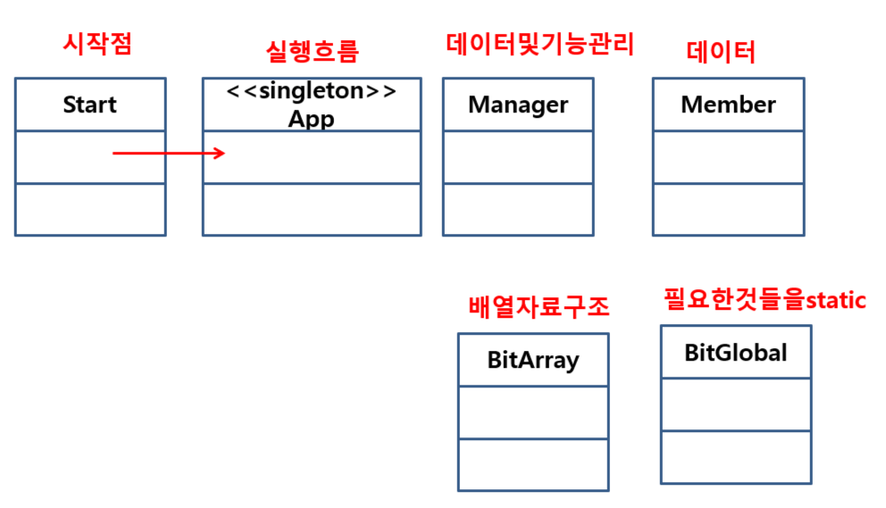

# 자료구조(DataStructure)

데이터 집합체를 어떻게 구조화 시키고 관리할 것인가?

규칙, 구조체에 따라 데이터를 **효율적으로** 정리하기 위한 형식


> 선형자료구조

- 연접리스트(배열) : 메모리적으로 연결

- 연결리스트(단일, 이중, 환형) : 논리적으로 연결

나머지 자료구조들은 배열이나 연결리스트를 응용해서 구현!

- 스택

- 큐

- 덱

> 비선형자료구조

- 트리

- 그래프

- 해쉬테이블


## 선형자료구조

### 연접리스트

데이터 저장관리를 **배열**이라는 자료구조로 하겠다.

- insert(저장), select(검색), update(수정), delete(삭제)


배열 자료구조 성질

=> 항상 0번째 인덱스부터 순차적으로 저장된 형태를 유지한다!

```bash
아래의 내용을 준수하며 클래스를 만든다.

1) 저장소 : 배열
2) max : 최대 크기
3) size : 저장개수, 저장위치
```


#### 실습#1

> 순서

1. 클래스 정의, 멤버필드 구성

ex)

클래스명 : BitArray

저장소 : Object[] base;

max : int max;

size : int size;


이와 같은 꾸밈을 **클래스 다이어그램**이라 한다. UML에서 사용됨. (-) : private, (+) : public


2. 생성자 정의

=> 멤버필드의 초기화

ex)

max : 매개변수 전달

size : 0으로 초기화

base : max값의 크기에 맞추어 동적으로 할당. 


인자가 없는 생성자도 만들기. => default값으로 넣어둔다.

힙 메모리공간에는 new를 했을 때 생성! 위의 클래스에서 생성자가 실행되면 배열이 담겨지게 된다.

```java
//2.생성자
public BitArray() {
    this(10);//아래의 매개변수를 사용하는 생성자를 명시적으로 호출!
}
public BitArray(int max) {
    setMax(max);	//this.max=max;
    setSize(0);
    base = new Object[max];
}
```


3. get & set

우클릭 - sources - getter and setter로 쉽게 생성가능.

setter메서드는 외부에서 넣을 수 없도록 private으로 수정했다.


4. 기능 메서드

- Insert(Object obj) : 스택오버플로우(저장공간이 다 찬 상태)를 확인해줘야한다.

  예외처리를 발생시켜서 true flase로 구동되도록하자!

```java
//overflow에 대한 조건이 필요하다!
private boolean IsOverflow() {
    if(max<=size)//overflow상태
        return true;
    else
        return false;
}

public void Insert(Object obj) throws Exception {		
    if(IsOverflow()==true) 
        throw new Exception("저장 공간이 부족합니다");

    //해당 객체 넣기
    base[size]=obj;
    size++;					
}
```


- Delete(int idx) : 삭제되면 하나씩 앞당겨지도록!

base[1]를 삭제한다는 것은 

base[1] = base[2];

base[2] = base[3];

base[3] = base[4];

위처럼 덮어쓰게 되는 것이다. size값은 바뀌게 되고 마지막값은 무의미해진다. 

1. 반복문을 활용해서 이동
2. size감소
3. 예외를 생각해보자! 전달하는 값은 idx. 이 idx가 유효한지 아닌지를 판단해야한다. 유효한 인덱스인지 0~size-1까지 확인하기.

```java
private boolean IsUseIdx(int idx) {		

    //0~size-1까지 시작 - 비어있는상황체크(size=0)
    if(idx>=0 && idx<=size-1) 
        return true;
    else 
        return false;
}

public void Delete(int idx) throws Exception {

    if (IsUseIdx(idx)==false)
        throw new Exception("유효하지 않은 인덱스 접근입니다.");

    //해당인덱스 삭제
    for(int i=idx;i<size-1;i++) {
        base[i]=base[i+1];
    }
    //사이즈 감소
    size--;
}
```


- Select() : 검색 메서드

순차검색 : 시작 -> 끝 순차적 -> 오늘구현내용

이분법적검색 : 정렬을 전제로 한다.

```java
public void Select() {
    for(int i=0;i<size;i++) {
        Object obj = base[i];

        //필요한 알고리즘!
    }
}
```


#### 실습#2



> Start.java App.java BitGlobal.java 연동해서 사용할 것!

App.java - Singleton 패턴

Run() : 반복

1. 메뉴 출력 및 선택
2. 선택에 따른 분기문

Init() :최초 단 한 번

Exit() : 종료시 단 한 번


BitGlobal.java - 필요한 것들을 static

Logo() : App.java의 Init()사용

Ending() : App.java의 Exit() 사용


Start.java

메인 함수가 있는 곳

`next(), nextLine()` : 전자는 버퍼에 엔터가 남아있다. 후자는 가져간다!


#### 📌디자인패턴 - 싱글톤 패턴

객체를 하나만 생성할 수 있는 클래스를 만들고싶다.

1. 생성자가 외부로 노출되면 안됨!

2. 해당 클래스에서 내부적으로 객체를 만든다.

   멤버 필드로 생성된 객체를 선언하고 생성!(static)

3. **객체를 외부에 노출시킬 static 메서드를 제공** - 외부에서 접근하는 인터페이스가 된다.

> 시작점! 생성자를 private 으로 만들기

```java
//생성자 은닉!
private App() {
    Init();
}

//자신의 static 객체 생성
private static App Singleton = new App();

//내부적으로 생성된 자신의 객체를 외부에 노출 메서드
public static App getInstance() {
    return Singleton;
}
```

외부에서는 `getInstance()` 함수를 통해서 객체를 사용하면 된다!

> Start.java

```java
public static void main(String[] args) {
    App app = App.getInstance();//객체를 가져다 쓴다!
    app.Run();
    app.Exit();
}
```


> Manager.java에서 질문!!

동등 비교 연산자의 올바른 사용법

```java
private Member NameToMember(String name) throws Exception {
    for(int i=0;i<arr.getSize();i++) {
        Member mem = (Member)arr.getData(i);
        if(mem.getName() == name) {//담고있는 string이 같은지 체크
            //순차검색
            return  mem;
        }
    }
    throw new Exception("업는 회원입니다");
}
```

`==` : 저장하고 있는 주소값을 비교.

`equals()` : 주소값을 타고 들어가서 저장된 값을 비교 연산.


#### 실습#3

> 은행시스템 만들기

실습#2에서 한것처럼 Bank를 중심으로 돌아가는 기능을 만든다.

계좌번호 중복처리를 해준다.

```java
//계좌번호를 중복체크
private boolean IsAccNumberCheck(int accid) {
    for(int i=0;i<arr.getSize();i++) {
        Account acc = (Account)arr.getData(i);
        if(acc.getAccid()==accid) {
            //순차검색
            return true;
        }
    }
    return false;
}
```


#### 디버깅

실행시 오류를 찾는 과정! => 해결까지!


#### 과제

입출금 기능 추가

단계1) 입출금 관련된 데이터 클래스 정의

단계2) 입출금을 저장할 데이터 저장공간 생성(기존 BitArray 사용가능)

단계3) 기능 구현 : 저장

단계4) 기능 구현 : 출력

======================================

삭제 : 해당 계좌를 삭제할 때, 입출금 내용을 먼저 삭제 한 후 계좌를 삭제해 보자!


