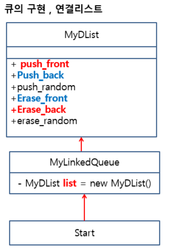

## 스택(LIFO : Last In First Out)


성질 : 입구와 출구가 동일하다.

구현 : 배열, 연결리스트

- 나중에 넣은것이 먼저 나온다.

- top의 위치는 항상 데이터가 마지막으로 저장된 위치값을 갖는다.


> 만들 수 있는 기능 

1.  push 연산 (데이터 저장)
2.  IsOverflow() : 오버플로우체크
3.  pop 연산 (데이터 삭제) 
4.  IsEmpty() : 비어있는지 체크

5. printAll() : 전체출력

6. GetTop : 제일 마지막에 저장된 값.

7. Clear() : 초기화 함수 => 내용을 지워도 되지만 top만 -1로 재설정 시켜도 괜찮다!


### 스택 - 연결리스트

📌들어오는입구와 나오는 출구가 같아야한다!! 

어제 구현한 연결리스트로 스택을 만들어보자.

push_front() : 넣은 순서가 뒤로 가도록

pop_front() : 마지막에 넣은것이 먼저 빠지기

(큐에서는 뒤로 넣은것을 앞으로 앞으로 넣은것을 뒤로 빼면 된다)


> Start.java가 MyLinkedStack.java를 사용하고 MyLinkedStack.java가 MyDList.java를 사용하는 구조를 만들어라!


## 큐(FIFO : First In First Out)

성질 : 입구와 출구가 다르다.

구현 : 배열, 연결리스트

>종류

1. 선형큐 알고리즘

2. 원형큐 알고리즘

3. 개선된 원형큐 알고리즘


### 선형큐

입구 : rear

출구 : front

배열에서의 저장 알고리즘과 같다.

`rear`는 저장할 위치 정보를 갖고있다.

`front`는 삭제할 위치 정보를 갖고있다.

rear++; front++;

- Overflow 조건

  **front가 이동하여 하단이 비어있어도 overflow상태이다.**

  => Max<=rear

- Empty조건

  => front==rear


### 원형큐

데이터를 채웠을 때 rear가 max다음값을 갖게되면 다시 0의 위치부터 내려가도록.

rear = (rear+1)%max;

ex) max가 5일 때, rear가 4의 값이 넘어가면 다시 0부터 하나씩 값을 갖게된다.

- Overflow 조건

  front==rear

- Empty조건

  front ==rear(선형큐와 동일)

=> Overflow와 Empty가 조건이 동일하게 되어서 어느 상태인지 파악이 어려워진다!

이 부분을 개선하기 위해 나온 알고리즘이 **개선된 원형큐 알고리즘**이다!!!


### 개선된 원형큐

위의 문제 해결법 => 공간하나를 비워두자!

max값의 공간을 다 채우는 것이 아닌 하나를 비운다.

- Overflow 조건

  front==(rear+1)%max 공간이 하나 비어졌을때

- Empty조건

  front ==rear (선형큐와 동일)


LinkedList로 진행할 때에는 push_back으로 넣은뒤 pop진행 시 erase_front를 진행한다.




## 실습

#1. 스택을 이용하여 ReverseString 함수를 구현할 것!

​	[원본의 문자를 스택에 PUSH]

​	[다시 POP한 문자를 문자열에 저장하여 반환]


#2. 스택을 이용하여 10진수를 2진수로 출력하는 함수 구현


## 활용

연산표기법 : 중위(A+B) / 후위(A B +)/  전위 표기법

- 중위 표기법 → 후위 표기법

ex) ( A + (B * C)) → A B C * +

1. 스택 생성

2. 순환(전달된 문자열의 끝까지)

   2.1 '(' 괄호 무시

   2.2 피연산자라면('A'~'Z') 출력

   2.3 연산자라면(+,-,*,/) 스택에 PUSH

   2.4 스택에서 POP

   ​	POP결과를 출력!


**공백처리해주기!!**


> 후위 표기법에 대한 연산 수행

```java
ex) str = 1 2 3 * 4 5 - - 6 + +
=>(1+ (2*3)-(4-5) + 6)
   1+6+1+6=14
int postfix_cal(String str){
    //1.스택 생성
    //2.반복(문자열 끝까지)
    /*	2.1 피연산자라면 : 스택에 push(문자를 숫자로 변경, 문자-'0' 하면된다~!! ex. '1'-'0')
    	2.2 연산자라면 : POP()을 해서 먼저 나온게 연산자의 오른쪽에 붙인다. POP()을 해서 후에 나온게 연산자의 왼쪽에 붙인다.
    	연산자를 이용해 결과값을 생성.
    	결과를 스택에 PUSH
    */
    //3. 스택 POP결과값
    //4. POP한 값을 반환
}
```


## 팀과제

어떻게 구현할 것인가?( 클래스의 추상적 정의 )


SRT/ 버스 좌석 예약프로그램!!!을 만들것

회원관리 : 연결리스트

SRT or 버스의 좌석 예약 상황 관리 : 2차원 배열

대기자 : 큐(예약이 다 찬 경우)

좌석을 예약한 사람이 취소를 할 경우

자동으로 해당 좌석에 예약 처리!